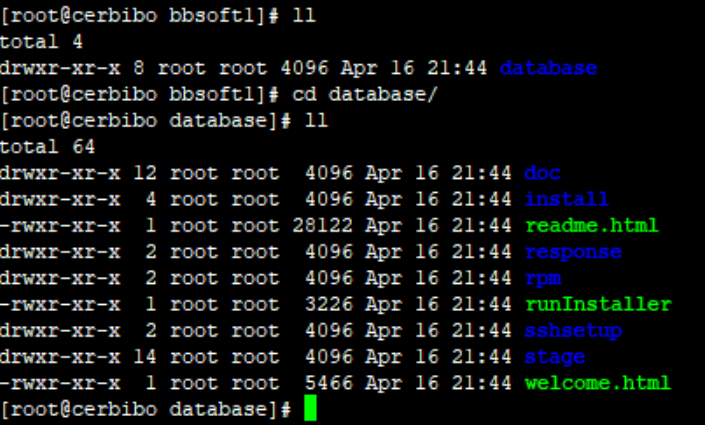
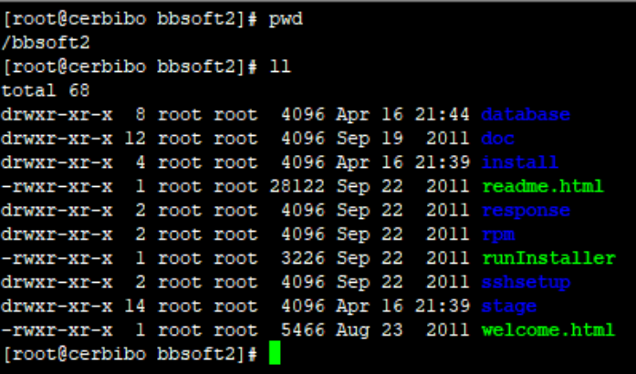
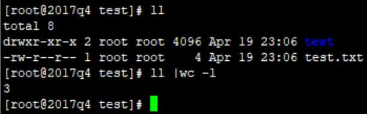
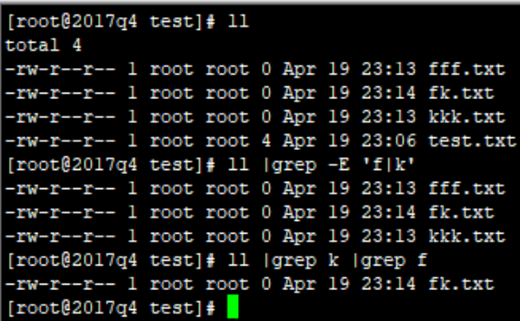

# RedHat6
## 前言

::: warning
为了撑场面，原封不动的抄了一份CentOS6的，没啥区别
:::

::: danger
最重要的是，这些只发生在6版本:sunglasses:
:::

## 基础常用
### 时间校准

单点登录、加解密经常由于服务器时间不准出问题

``` bash
ntpdate us.pool.ntp.org
```
如果找不到时钟服务器，或者没办法yum，就直接打开北京时间手动对时
``` bash
date -s "2020-04-15 14:15:00"  
clock -w
```

### 打包解包
#### 打包
把mubiao这个文件夹，打包成mubiao.tar
``` bash
tar -cvf mubiao.tar mubiao
```
把file1 file2 dir1，打包成123.tar
``` bash
tar -cvf 123.tar file1 file2 dir1
```
压缩打包，酌情使用，一般也就文本类的压缩率高一些，并且这种打包很费时间

把aaa.txt   bbb.txt   ccc.txt打包压缩为一个名叫xxx.tar.gz 压缩包
xvf: 解压缩 
``` bash
tar -zcvf xxx.tar.gz aaa.txt bbb.txt ccc.txt
```
#### 解包
普通解
``` bash
tar -xvf mubiao.tar
```
压缩包解包
``` bash
tar -zxvf apache-tomcat-7.0.75.tar.gz 
```

### rsync同步
碎文件、大文件使用这个命令可以断了续，续了断，比cp强一些

其余参数网上搜即可

注意一下带/和不带/有一点区别

同步之前



src不带/,用这个命令同步之后
``` bash
rsync -a -H -v --progress --stats /bbsoft1/database /bbsoft2
```


src带/，用这个命令同步之后
``` bash
rsync -a -H -v --progress --stats /bbsoft1/database/ /bbsoft2
```



### 防火墙

重定向方案
``` bash
iptables -t nat -A PREROUTING -p tcp -m tcp --dport 80 -j REDIRECT --to-ports 8081
iptables -t nat -A PREROUTING -p tcp -m tcp --dport 443 -j REDIRECT --to-ports 8444
iptables -A INPUT -p tcp -m state --state NEW -m tcp --dport 80 -j ACCEPT
iptables -A INPUT -p tcp -m state --state NEW -m tcp --dport 8443 -j ACCEPT
service iptables save
service iptables restart
```

### 环境变量
``` bash
vi /etc/profile
```
打开后，例如我想配置个Java环境

那么在后面添加几句，wq即可
``` bash
export JAVA_HOME=/usr/java/jdk1.8.0_131
export PATH=$JAVA_HOME/bin:$PATH
export CLASSPATH=.:$JAVA_HOME/lib/dt.jar:$JAVA_HOME/lib/tools.jar
```
### 系统配置
最合适的还是这两句
``` bash
head -n 1 /etc/issue 
cat /proc/cpuinfo | grep name | cut -f2 -d: | uniq -c
```
### 系统配置
最合适的还是这两句
``` bash
head -n 1 /etc/issue 
cat /proc/cpuinfo | grep name | cut -f2 -d: | uniq -c
```

### 新建用户
集群模式，最好都用一样的UID,这里意思就是创建一个uid为700的用户
``` bash
useradd -u 700 bbuser
```
### 文件权限
chown更改所有权
``` bash
chown -R runoob:runoobgroup *
```
chmod更改访问权
r=4，可读；w=2，可写；x=1, 可执行
``` bash
chmod 761 test.sh
```
执行后，代表当前用户对这个文件有所有权限，当前用户的组没有执行权限，其他用户只有执行权限

工作中，一般Nas存储777出现的比较多，其余777的情况谨慎使用

### 结束进程
``` bash
ps -ef |grep tomcat
```
查出来后，找到第二列的PID
``` bash
kill -9 4394
```
-9比较有效，直接shutdown,生产平台慎用
### wc计数
一般wc -l用得较多，主要统计返回结果行数，例如查有几个文件
``` bash
ll |wc -l
```


total、test、test.txt 一共三行，所以返回结果是3
### grep条件
或条件，-E参数使用
``` bash
ll |grep -E 'f|k'
```
与条件多个grep即可
``` bash
ll |grep k |grep f 
```



### 全局查询
一般情况下，知道某个字符，想全局查一下在哪里出现

这个递归查询命令，比较实用
``` bash
grep -rn '8443' *
```
或者指定文件类型
``` bash
grep -rn '8443' *.properties
```

### telnet
这个命令也非常实用，如果想判断当前的网络环境是否能接通目的业务，那么这个最合理
``` bash
telnet 192.168.1.22 1521
```
如果命令通了，那么则证明1521端口不但开通了，并且有服务注册在了1521端口上
### 端口使用
``` bash
netstat -anp |grep 61616
```
一般拿这个统计端口并发，效果甚佳
``` bash
netstat -anp |grep 8080 | wc -l
```